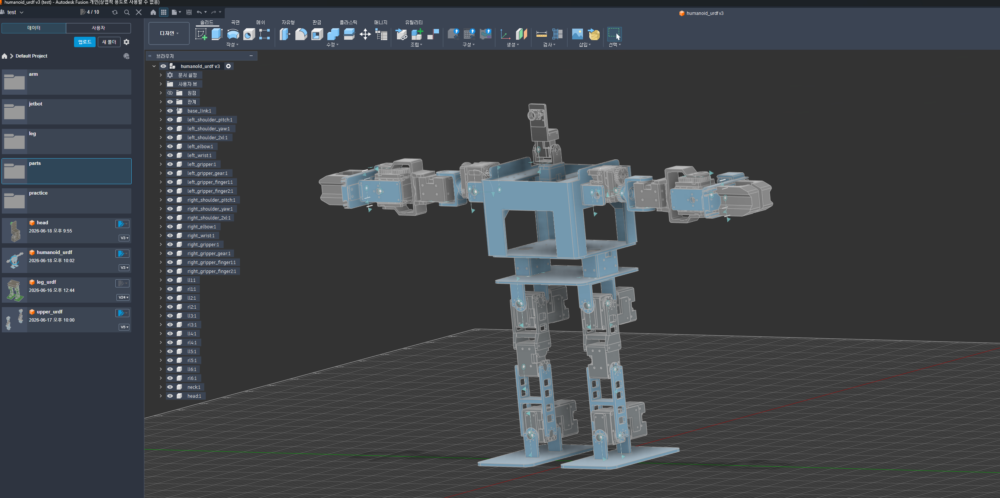
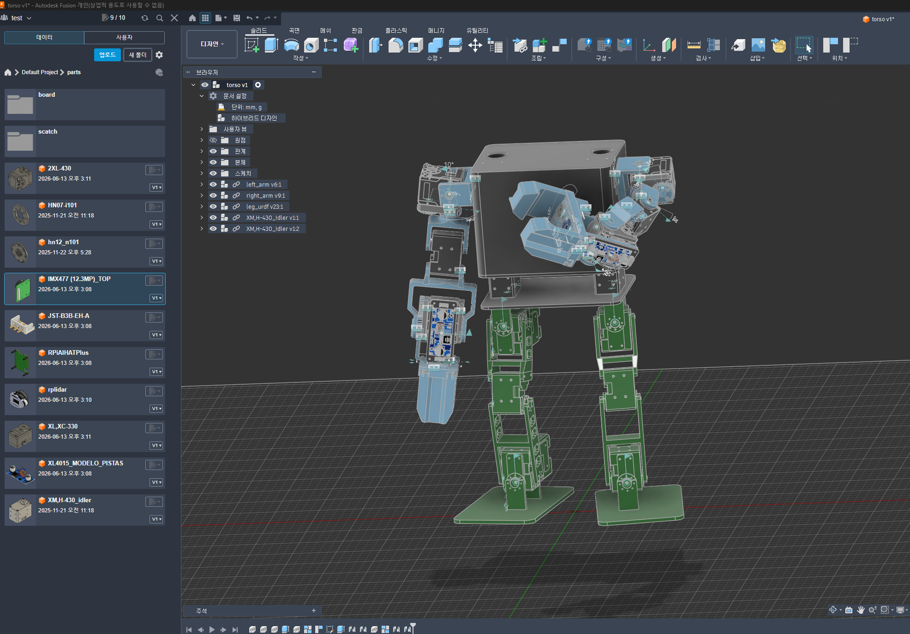

# 준비

- 로봇
	- op3 leg + toddlerbot arm + rgb camera
- 최종로봇목표
	- 하체는 밸런싱 보드에서 균형 잡고 상체는 책상 위 주사위를 들어 번호 순으로 여러 개를 쌓는 작업을 구현 목표
- 학습
	- 하체는 isaaclab 강화학습
	- 상체는 lerobot 모방학습
	- +상하체 보강용 강화학습
- 추론
	- 상하체 모델 출력 + 보강용 모델 결과
- 부품
	- 하체 다이나믹셀 XL430-W350-R x 12
	- 상체 다이나믹셀 XL430 x 4 , 2XL430 x 4 , XL330 x 4
	- rgb 카메라
	- opencr, u2d2, rasberrypi5, ai hat+, buck converter, dynamixel hub
	- oculus quest2
	- 리튬베터리 11v
	- 나사 2 x 8, 2.5 x 8 많이 
	- 황동 히트 인서트 2 x 2, 2.5 x 2 많이
- system
  - edge inference : rasberrypi5(opencr) hailo8G debian venv ros noetic
  - simulation : rtx3080 desktop window11 cuda12.8 isaacsim ros2 humble
  - train : ascent gx10 128G ubuntu cuda13
    - lerobot venv
    - isaaclab conda

# 4. 멀티 태스크 구현

# 5. 협동 로봇 구현

# 참고
https://github.com/ROBOTIS-GIT/ROBOTIS-OP3-Common  
https://www.robotis.com/service/downloadpage.php?ca_id=70  
https://emanual.robotis.com/docs/en/platform/op3/robotis_ros_packages/#robotis-ros-packages  
https://www.youtube.com/watch?v=tQziqSx-F80&t=1970s  
https://github.com/kscalelabs/ksim-gym/tree/master  
https://github.com/hshi74/toddlerbot  