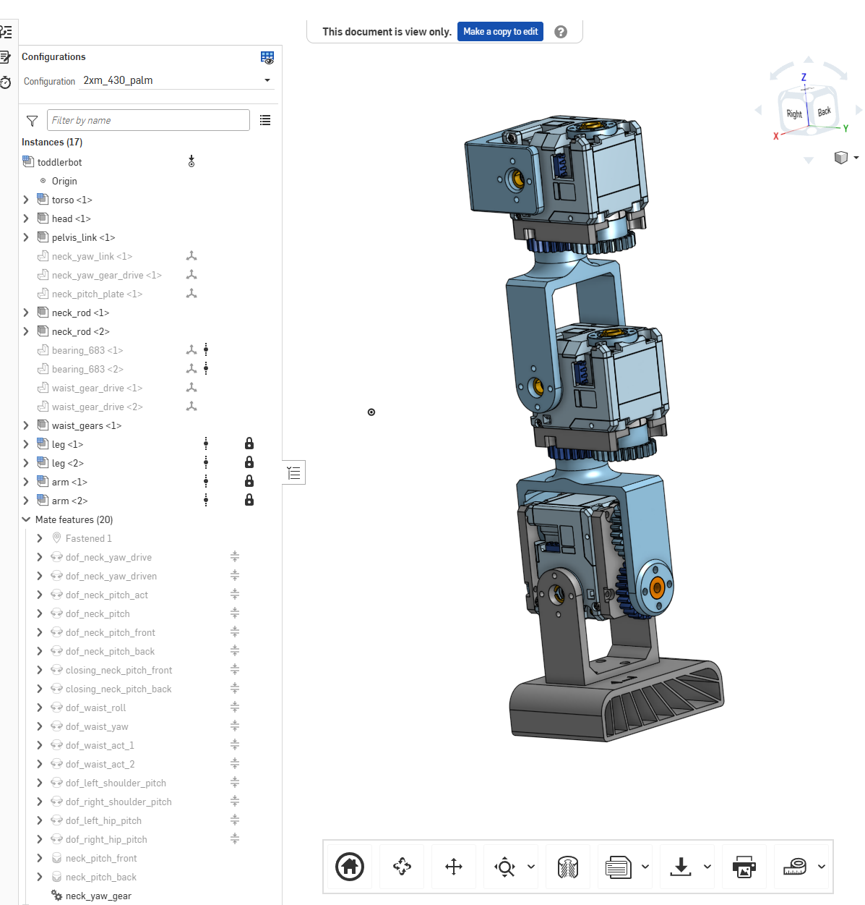
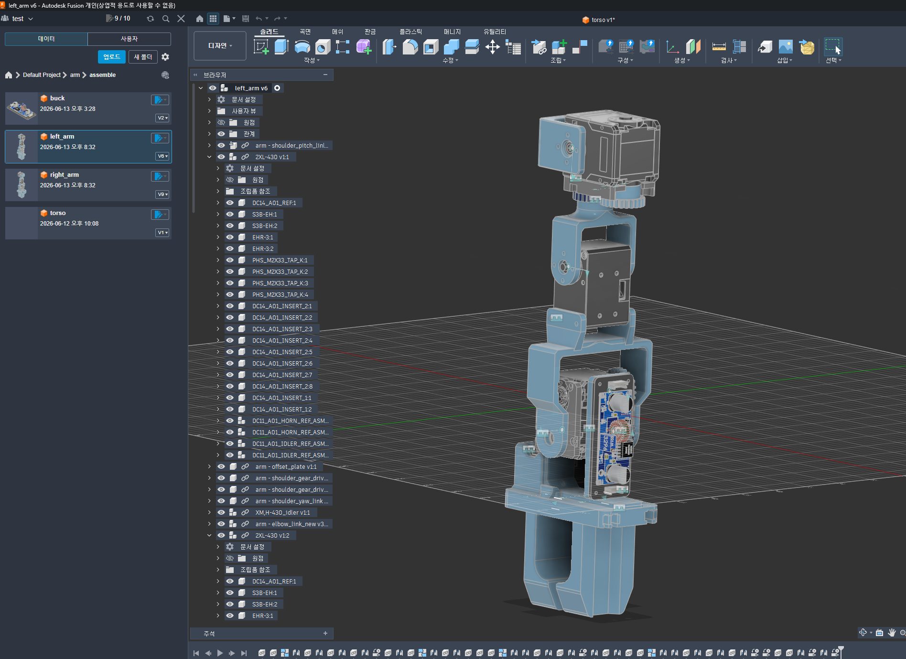
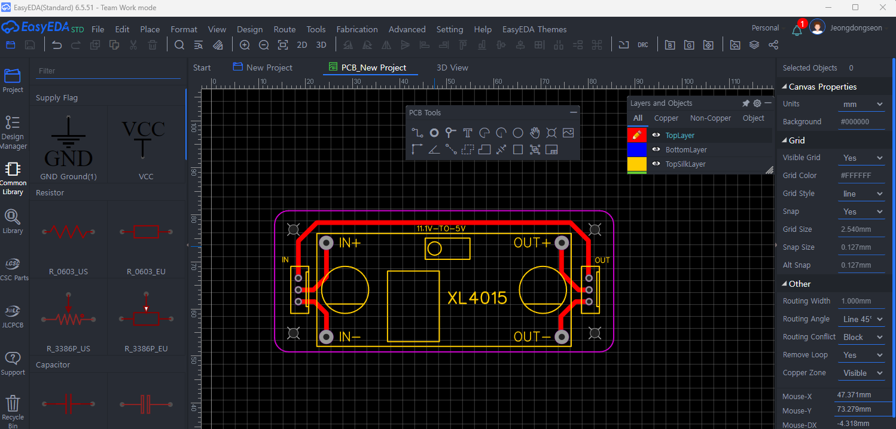
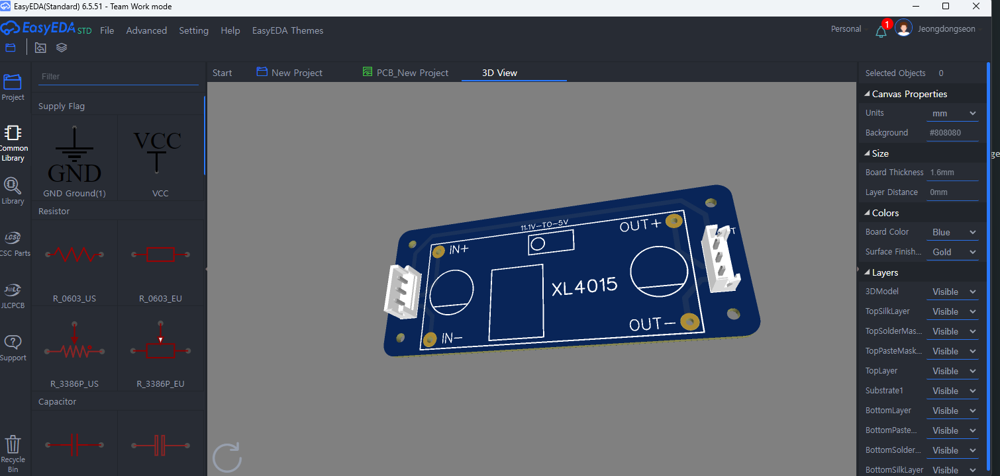

## 3d 프린팅 부품 설계

- 팔 설계 변경  
오리지날  

변경(덕컨버터 마운트 적용, 엘보 자유도 -1)  



- 모터 볼트 컨버터용 pca 제작  
easyEDA 사용




## 3d 프린팅 조립


## isaacsim sim2real 구현
moveit
```bash
apt update
apt install -y ros-noetic-moveit ros-noetic-moveit-visual-tools

# 1. WSL 하드웨어 그래픽 가속 무력화
export LIBGL_ALWAYS_SOFTWARE=1
export GALLIUM_DRIVER=softpipe

# 2. X11 공유 메모리 에러 차단
export QT_X11_NO_MITSHM=1
export MITSHM=0

# 3. MoveIt 다시 로드
roslaunch moveit_setup_assistant setup_assistant.launch
```


## 오큘러스 teleoperation
open teach 사용  
lerobot dataset 변환

## 합성 데이터 셋 생성
isaacsim augmentation  
cosmos transfer 모델로 생성  

## vla manipulation 학습
lerobot 학습

